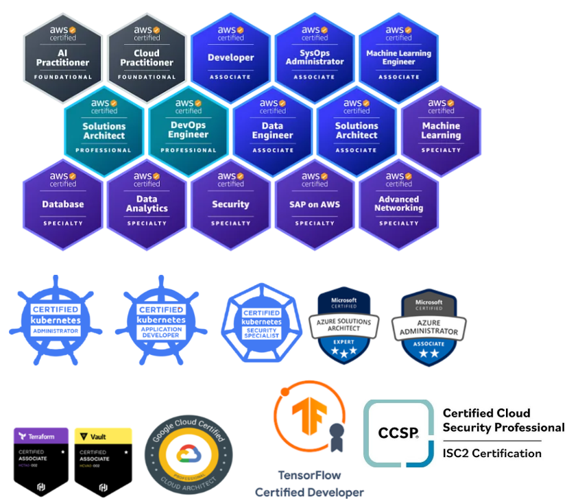

# 👋 Hi, I'm Kugathasan Janarthanan (Jana)

### 🚀 Site Reliability Engineer | Backend Developer | Cloud Architect | Freelancer

Greetings! I’m a seasoned engineer with **10+ years** of experience delivering high-impact solutions across **Software Development, DevOps, Cloud Automation, and Machine Learning**.

I specialize in building robust, scalable infrastructure using tools like:

- ☁️ **Cloud Platforms**: AWS | GCP | Azure  
- 🛠️ **DevOps & Automation**: Terraform | Kubernetes | Ansible | Docker | GitHub Actions  
- 💻 **Languages**: Python | Golang | Bash | PowerShell  
- 🧠 **ML & Data**: TensorFlow | Scikit-learn | Pandas | AWS SageMaker | LLM 
- 📈 **Monitoring & Logging**: Prometheus | Grafana | Splunk | ELK Stack  
- 🔌 **Others**: Active Directory | React | Kafka | Jenkins | HAProxy | PostgreSQL | MySQL | Raspberry Pi

---

### 🔧 What I Do

- 🧱 Architect and automate infrastructure across multi-cloud environments  
- ⚙️ Design and implement CI/CD pipelines for seamless delivery  
- 📊 Build ML-driven systems for real-time monitoring and anomaly detection  
- 🌐 Develop backend systems and secure APIs  
- 🧑‍🏫 Mentor and support engineering teams with best practices  
- 🤝 Freelance on automation and cloud migration projects

---

### 📜 Certifications

---

### 📚 My Blog

I created my [**Tech Blog**](https://scripting4ever.wordpress.com/) to share real-world insights, solutions, and automation tips from my daily work. From SRE practices to cloud-native tools, you’ll find practical knowledge and tutorials to empower your own projects.

---

### 📫 Let’s Connect

- 🌐 [Blog](https://scripting4ever.wordpress.com/)  
- 💼 [LinkedIn](https://www.linkedin.com/in/janarthanan-kugathasan)   
- 📧 Email: kugathasan.janarthanan@gmail.com

---

> _"Real growth begins outside the comfort zone. I thrive on solving challenges, building smart systems, and making technology simple and powerful."_  

Thanks for visiting my profile! ⭐️ Don’t forget to follow and check out my pinned repos!

