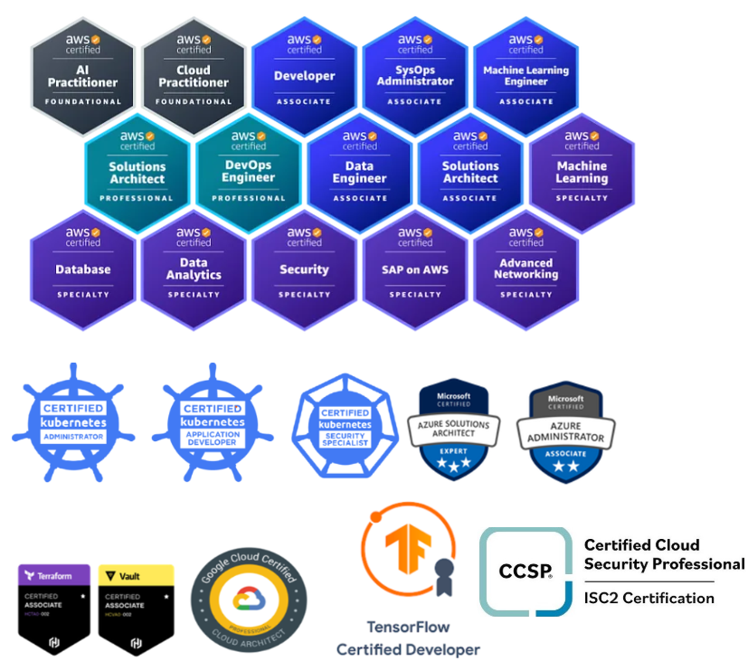
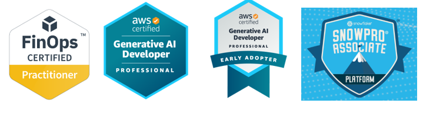

# 👋 Hi, I'm Kugathasan Janarthanan (Jana)

[+Engineer;Active+Directory+(LDAP%2FKerberos)+%7C+AWS+IAM;GCP+Workload+Identity+Federation+%7C+OIDC%2FSSO;Cloud+Architect+%7C+11%2B+Years+of+Experience)](https://git.io/typing-svg)

Greetings! I'm an **Identity & Access Management (IAM) Engineer** with **11+ years** of experience designing, securing, and scaling authentication and authorization infrastructure across hybrid and multi-cloud environments.

My core focus is **Active Directory (LDAP/Kerberos)**, **AWS IAM**, **GCP Workload Identity Federation**, and **OIDC/SSO** — backed by a broader background in Cloud Automation, DevOps, Backend Development, and Machine Learning.

---

### 🔐 Identity & Access Management

---

### 🛠️ Tech Stack

**Cloud Platforms**

**DevOps & Automation**

**Languages**

**ML & Data**

**Monitoring & Logging**

**Other Tools & Platforms**

---

### 🔧 What I Do

- 🔐 Design and harden identity architectures spanning Active Directory, LDAP, and Kerberos
- 🔑 Implement least-privilege AWS IAM (roles, policies, STS, permission boundaries) and GCP Workload Identity Federation for keyless, short-lived cloud access
- 🪪 Build OIDC/SSO integrations and automate identity lifecycle & provisioning with SCIM
- 🧱 Architect and automate infrastructure across multi-cloud environments
- ⚙️ Design and implement CI/CD pipelines for seamless delivery
- 📊 Build ML-driven systems for real-time monitoring and anomaly detection
- 🌐 Develop backend systems and secure APIs
- 🧑‍🏫 Mentor and support engineering teams with best practices
- 🤝 Freelance on IAM, automation, and cloud migration projects

---

### 📜 Certifications

---

### 📚 My Blog

I created my [**Tech Blog**](https://scripting4ever.wordpress.com/) to share real-world insights, solutions, and automation tips from my daily work. From identity & access management to SRE practices and cloud-native tools, you'll find practical knowledge and tutorials to empower your own projects.

---

### 📫 Let's Connect

---

> _"Real growth begins outside the comfort zone. I thrive on solving challenges, building smart systems, and making technology simple and powerful."_

Thanks for visiting my profile! ⭐️ Don't forget to follow and check out my pinned repos!

